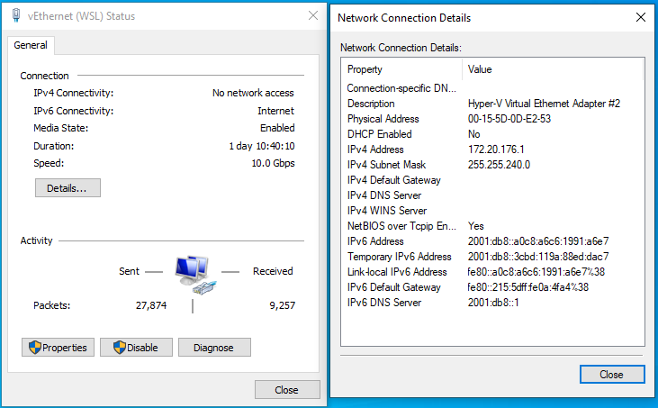
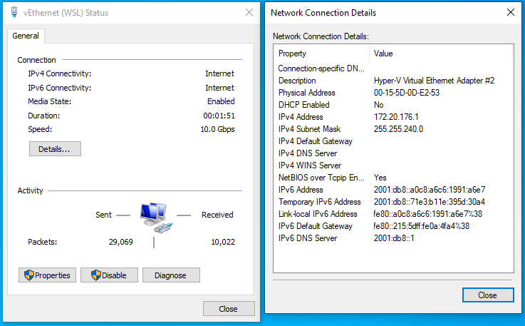
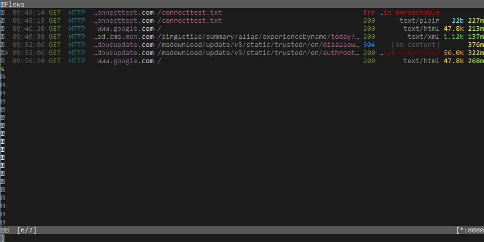

# Host MITM attack via IPv6 rogue router advertisements (K8S CVE-2020-10749 / Docker CVE-2020-13401 / LXD / WSL2 / ...)

IPv6 is enabled by default on most devices and OSs today, and they also accept router advertisements (RA) by default to configure IPv6 IPs, routes and sometimes DNS servers.

Any device in the same L2 can send router advertisements, but only routers are legitimate to send them, so, to secure networks, most managed switches include a feature called RA-Guard that allow / block RA for each port.

As the title gives it away, the container world forgot about this attack vector.
By sending “rogue” router advertisements, an attacker can reconfigure the host to redirect part or all of the IPv6 traffic of the host to the attacker controlled container.
Even if there was no IPv6 traffic before, if the DNS returns A (IPv4) and AAAA (IPv6) records, many HTTP libraries will try to connect via IPv6 first then fallback to IPv4, giving an opportunity to the attacker to respond.

## Tested software

- Kubernetes: [CNI CVE-2020-10749](https://github.com/kubernetes/kubernetes/issues/91507), also affected but not tested by myself, Calico ([CVE-2020-13597](https://www.projectcalico.org/security-bulletins/)), Flannel ([PR1298](https://github.com/coreos/flannel/pull/1298)) and Weave Net ([CVE-2020-11091](https://github.com/weaveworks/weave/security/advisories/GHSA-59qg-grp7-5r73))
- Docker: [CVE-2020-13401](https://docs.docker.com/engine/release-notes/#190311)
- LXD: Not affected in default config, but some fixes as a result of the report ([PR7091](https://github.com/lxc/lxd/pull/7091), [PR7097](https://github.com/lxc/lxd/pull/7097), [PR7098](https://github.com/lxc/lxd/pull/7098))
- Openstack: antispoofing enabled by default, so not affected (asked a friend for iptables rules dump and did some code review)
- Microsoft WSL2: Hyper-V has DHCP-Guard and Router-Guard enabled by default, but WSL2 that is based on Hyper-V doesn't have those security features enabled

## POCs / Report

Hereafter, the reports sent to the Kubernetes team and Microsoft. Docker and LXD reports were really similar to the Kubernetes one.

### Kubernetes

#### Summary

In many K8S network configurations, the container network interface is a virtual ethernet link going to the host (veth interface). In this configuration, an attacker able to run a process as root in a container can send and receive arbitrary packets to the host using the `CAP_NET_RAW` capability (present in the default configuration).

In a K8S cluster with an IPv4 internal network, if IPv6 is not totally disabled on the host (via `ipv6.disable=1` on the kernel cmdline), it will be either unconfigured or configured on some interfaces, but it’s pretty likely that ipv6 forwarding is disabled, ie `/proc/sys/net/ipv6/conf/*/forwarding == 0`. Also by default, `/proc/sys/net/ipv6/conf/*/accept_ra == 1`. The combination of these 2 sysctls means that the host accepts router advertisements and configures the IPv6 stack using them.

By sending "rogue" router advertisements, an attacker can reconfigure the host to redirect part or all of the IPv6 traffic of the host to the attacker controlled container.
Even if there was no IPv6 traffic before, if the DNS returns A (IPv4) and AAAA (IPv6) records, many HTTP libraries will try to connect via IPv6 first then fallback to IPv4, giving the attacker an opportunity to respond.
If by chance you also have on the host a vulnerability like last year’s RCE in apt (CVE-2019-3462), you can now escalate to the host.

As `CAP_NET_ADMIN` is not present by default in K8S pods, the attacker can’t configure the IPs they want to MITM, they can’t use iptables to NAT or REDIRECT the traffic, and they can’t use `IP_TRANSPARENT`. The attacker can however still use `CAP_NET_RAW` and implement a tcp/ip stack in user space.

This report includes a POC based on [smoltcp](https://github.com/smoltcp-rs/smoltcp) that sends router advertisements and implements a dummy HTTP server listening on any IPv6 addresses.

This vulnerability can easily be fixed by setting `accept_ra = 0` by default on any interface managed by CNI / K8S.

#### Steps To Reproduce

Watch the POC recording:
[](https://asciinema.org/a/jqFcyRsVOOT33zp8YLdaOyni4)

1.  Download the source of the POC:

    1. [Cargo.toml](k8s/Cargo.toml)
    2. [src/main.rs](k8s/src/main.rs)

2.  Compile it with `cargo build --release`. You now have a binary called ipv6mitm.

3.  Launch a dummy Pod:

    ```
    kubectl apply -f - <<'EOF'
    apiVersion: v1
    kind: Pod
    metadata:
      name: ubuntu-pod
    spec:
      containers:
        - name: ubuntu
          image: ubuntu:latest
          command: [ "/bin/sleep", "inf" ]
    EOF
    ```

    (In our scenario the attacker is able to run code as root in a "normal" pod of the cluster)

4.  Find on which node the ubuntu-pod is running using `kubectl get pod -o wide`, then ssh into it.

5.  On the node, try `curl http://www.google.com -v`.

    Right now you should get a normal response, and you can see in the first few lines that IPv4 was used.

6.  This is the attack part:

    ```
    # copy the ipv6mitm binary
    kubectl cp ipv6mitm ubuntu-pod:/
    # connect to the pod
    kubectl exec -it ubuntu-pod /bin/bash
    # and run the binary
    /ipv6mitm -i eth0
    ```

7.  On the node, try `curl http://www.google.com -v` again.

    You should see that IPv6 was used and the response is just "ok", it came from the container.

### Microsoft WSL2

#### Summary

By default the "Hyper-V Virtual Ethernet Adapter" interfaces used for Hyper-V ('vEthernet (Default Switch)') and for WSL2 ('vEthernet (WSL)') are configured with static IPv4 but automatic IPv6, meaning any rogue Hyper-V or WSL2 VM can reconfigure the host network using DHCPv6 or IPv6 router advertisements. Using WPAD an attacker can also intercept part of the IPv4 traffic.

This is "just" an insecure default configuration, but, chained with any client RCE, this could lead to VM escape to the host.

I saw that Hyper-V does offer DHCP Guard and Router Guard settings, but couldn’t find the equivalent for WSL2.

I know that changing the default configuration can be hard, but a VM should not be able to intercept host traffic by default.

I only have access to Win10 machines so I couldn’t test any Windows server editions.

Testing was done on Microsoft Windows [Version 10.0.19041.172] / Ubuntu 18.04 WSL2

#### POC

Here follows a POC showing how a root user in Ubuntu 18.04 WSL2 can easily intercept all IPv6 traffic, and, using WPAD, part of the IPv4 traffic of the host. The same attack also works from a Hyper-V VM.

The POC uses 2 programs:

- `mitmproxy`, to receive the traffic from the host once it has been configured by WPAD,

- `rafun` to send the router advertisements and act as a DNS and an HTTP server.

1.  Start a Ubuntu 18.04 WSL2 shell, become root

2.  Install `mitmproxy`:

    ```
    apt update
    apt install python3-pip
    pip3 install mitmproxy
    ```

3.  Build the `rafun` binary using golang 1.13+ by downloading [rafun.go](wsl2/rafun.go) / [go.sum](wsl2/go.sum) / [go.mod](wsl2/go.mod) then using run `CGO_ENABLED=0 go build`

4.  Configure an extra IPv6 on eth0:

    ```
    ip addr add 2001:db8::1/128 dev eth0
    ```

5.  Configure ip6tables redirect rules  to intercept IPv6 HTTP and DNS traffic

    ```
    ip6tables -t nat -I PREROUTING -i eth0 -p tcp --dport 80 -j REDIRECT --to-ports 80
    ip6tables -t nat -I PREROUTING -i eth0 -p udp --dport 53 -j REDIRECT --to-ports 53
    ```

6.  Find eth0 IPv4

    ```
    ip a
    ```

7.  Start rafun to intercept IPv6 only

    ```
    ./rafun -dnsAaddr=
    ```

    rafun is now sending IPv6 router advertisements with two /1 routes. If the host has IPv6 connectivity, the /1 routes take precedence over the default /0 route and the VM now effectively receives all the IPv6 traffic from the host

    You can note that the 'vEthernet (WSL)' status page says 'IPv6 connectivity: Internet'

    

8.  On the host, in a powershell shell run

    ```
    Invoke-WebRequest www.google.com
    Invoke-WebRequest doesntexist.google.com
    Invoke-WebRequest [2001::1]
    ```

    If the host has no IPv6 connectivity, Windows programs will prefer the primary interface IPv4 connectivity, so the VM will only receive DNS requests, but not a lot of traffic to mess with.

    If DNS requests on the DNS server of the primary interface fail, Windows will use rafun DNS responses and we will get some traffic.

    IPv6 requests will always go to the VM as the host has the two /1 routes

    Let’s now use WPAD.

9.  In a new WSL2 shell, start mitmproxy

    ```
    mitmproxy -p 8080
    ```

10. Stop rafun, and start it again with:

    ```
    ./rafun -dnsAaddr= -wpaddat="PROXY :8080"
    ```

    In step 7 rafun was intentionally failing the wpad dns responses, so it might take a bit of time, but you will note that at some point the 'vEthernet (WSL)' status page will say IPv4/IPv6 connectivity: Internet.

    

11. On the host, in a powershell shell run

    ```
    Invoke-WebRequest www.google.com
    ```

    You will see the request appears in mitmproxy, meaning the attacker was able to spy on it and if https was not used modify it.

    

## Timeline

* 2020-03-15: Initial report to K8S team
* 2020-03-25: Initial report to Docker team
* 2020-03-26: Initial report to LXD Team
* 2020-04-04: Initial report to Microsoft Team
* 2020-06-01: Public disclosure for K8S, Docker and many CNIs.
* 2020-06-24: Microsoft confirms that HyperV guest are protected by DHCP and Router Guard, but not WSL2. They decide to treat it as a normal bug and not a Update Tuesday security bug.

## Acknowledgments

Thanks to all the people that were involved, and special thanks to the K8S security team for coordinating with all the CNIs vendors.