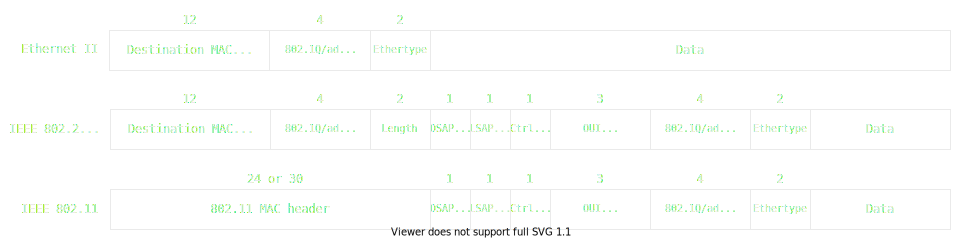

# Layer 2 network security bypass using VLAN 0, LLC/SNAP headers and invalid length

## TLDR

You should always drop unknown/unclassified traffic.
Using VLAN 0, LLC/SNAP headers and invalid length gives you multiple ways to
encapsulate the same L3 payload on Ethernet/Wifi, allowing to bypass some
L2 network security control implementations like IPv6 Router Advertisement Guard.

## Intro

Following my previous article on [VLAN 0](../VLAN0/README.md), I had two itches to scratch.

First, after reading [Proper isolation of a Linux bridge article from Vincent Bernat](https://vincent.bernat.ch/en/blog/2017-linux-bridge-isolation) some time ago and seeing:
```
$ cat /proc/net/ptype
Type Device      Function
0800          ip_rcv
0011          llc_rcv [llc]
0004          llc_rcv [llc]
0806          arp_rcv
86dd          ipv6_rcv
```
I wanted to understand what were those `llc` packets and what I could do with them,
but it took me a long time and some luck to craft some useful packets with LLC/SNAP headers.

Second, I wanted to test bypassing layer 2 security on managed switches. As I was staying home for the end of 2020 (COVID ...),
I decided to buy myself one of the cheapest Cisco switches with IPv6 first-hop security (CBS350-8T-E-2G), and was able to bypass its IPv6 RA Guard implementation using VLAN 0 and/or LLC/SNAP headers.

After reporting my findings to Cisco PSIRT, I reported these same bypasses to Juniper SIRT, but I didn't have time to continue reporting to all network vendors and coordinate between them. Thankfully I discovered that you can [report vulnerabilities that affect multiple vendors to CERT/CC](https://www.kb.cert.org/vuls/report/) and they will take care of reporting to and coordinating between all vendors.

The packet syntax in this article is the one used by [Scapy](https://scapy.readthedocs.io/).
If you want to try the examples you might need to replace `Dot3()` with `Dot3(src=get_if_hwaddr(ifname))`.

## Ethernet frame types

If you want to know everything, the following pages will do a better job than me:
- [Wikipedia - Ethernet frame](https://en.wikipedia.org/wiki/Ethernet_frame)
- [Wikipedia - IEEE 802.2](https://en.wikipedia.org/wiki/IEEE_802.2)
- [Wikipedia - IEEE 802.3](https://en.wikipedia.org/wiki/IEEE_802.3)
- [RFC 894 -  A Standard for the Transmission of IP Datagrams over Ethernet Networks](https://www.rfc-editor.org/rfc/rfc894)
- [RFC 948 - Two Methods for the Transmission of IP Datagrams over IEEE 802.3 Networks](https://www.rfc-editor.org/rfc/rfc948)
- [RFC 1042 - A Standard for the Transmission of IP Datagrams over IEEE 802 Networks](https://www.rfc-editor.org/rfc/rfc1042)
- [RFC 1122 - Requirements for Internet Hosts -- Communication Layers](https://www.rfc-editor.org/rfc/rfc1122)
- [RFC 2464 - Transmission of IPv6 Packets over Ethernet Networks](https://www.rfc-editor.org/rfc/rfc2464)
- [RFC 4840 - Multiple Encapsulation Methods Considered Harmful](https://www.rfc-editor.org/rfc/rfc4840)
- [RFC Draft - Extended Ethernet Frame Size Support](https://datatracker.ietf.org/doc/html/draft-ietf-isis-ext-eth)
- [RFC 5342 - Ethernet Protocol Parameters](https://www.rfc-editor.org/rfc/rfc5342#section-3)
- [Ask Wiresark - IEEE802a OUI Extended Ethertype](https://ask.wireshark.org/question/21547/ieee802a-oui-extended-ethertype/)
- [Novell - Migrating Ethernet Frame Types from 802.3 Raw to IEEE 802.2](https://support.novell.com/techcenter/articles/ana19930905.html)

To make it short, an Ethernet frame always starts with a preamble, start frame delimiter, MAC destination, MAC source, then VLAN headers (if used), and then the content depends on which of the 4 frame types you are using:
- Ethernet II: also known as DIX Ethernet, this is the most common, and starts with EtherType (2 bytes) that identifies the upper layer (0x0800 == IPv4, 0x0806 == ARP, 0x86DD == IPv6). See [RFC 894]((https://www.rfc-editor.org/rfc/rfc894)) and [RFC 2464](https://www.rfc-editor.org/rfc/rfc2464).
- Novell raw IEEE 802.3: This was used to transport IPX until the mid-nineties, starts with 2 bytes length then 0xFFFF.
- IEEE 802.2 LLC: in IEEE 802.3 standard a frame starts with 2 bytes length followed by 802.2 LLC (logical link control) header. 802.2 defines 3 operational modes, but we are only interested in unacknowledged connection-less mode. IPv4 and ARP can be encapsulated in 802.2 LLC headers as defined in [RFC 948](https://www.rfc-editor.org/rfc/rfc948), but as said in [RFC 1010](https://www.rfc-editor.org/rfc/rfc1010) from 1987 "The use of the IP LSAP is to be phased out as quickly as possible".
- IEEE 802.2 LLC/SNAP: [RFC 1042](https://datatracker.ietf.org/doc/html/rfc1042) defines how to encapsulate IP using LLC/SNAP, and this is the default for all 802 networks except Ethernet, DSAP == SSAP == 170 == 0xAA (SNAP Headers), Control == 3 (unacknowledged connectionless mode / U-format PDUs), SNAP OUI 24 bits == 0x000000 or 0x0000F8, SNAP protocol id 16 bits == EtherType.


LLC/SNAP with OUI 0x000000 can be called "SNAP RFC1042", and LLC/SNAP with OUI 0x0000f8 called "SNAP 802.1H".
I found "SNAP 802.1H" by chance while looking at Linux mac80211 code.

Using Scapy notation, here are 3 ways to encapsulate an ICMP Echo request to 192.168.1.2:
```
Ether()/IP(dst='192.168.1.2')/ICMP()
Dot3()/LLC(ctrl=3)/SNAP()/IP(dst='192.168.1.2')/ICMP()
Dot3()/LLC(ctrl=3)/SNAP(OUI=0x0000f8)/IP(dst='192.168.1.2')/ICMP()
```

Scapy is computing a lot of values for us, here the same packets expanded a bit:
```
Ether(type=0x0800)/IP(dst='192.168.1.2')/ICMP()
Dot3()/LLC(dsap=0xaa,ssap=0xaa,ctrl=3)/SNAP(OUI=0x000000,code=0x0800)/IP(dst='192.168.1.2')/ICMP()
Dot3()/LLC(dsap=0xaa,ssap=0xaa,ctrl=3)/SNAP(OUI=0x0000f8,code=0x0800)/IP(dst='192.168.1.2')/ICMP()
```

[RFC1122 - Section 2.3.3](https://www.rfc-editor.org/rfc/rfc1122#section-2.3.3) states that:
"Every Internet host connected to a 10Mbps Ethernet cable:
- MUST be able to send and receive packets using RFC-894 encapsulation;
- SHOULD be able to receive RFC-1042 packets, intermixed with RFC-894 packets; and
- MAY be able to send packets using RFC-1042 encapsulation.
An Internet host that implements sending both the RFC-894 and the RFC-1042 encapsulation MUST provide a configuration switch to select which is sent, and this switch MUST default to RFC-894."

After reading section 2.3.3, it's less surprising to know that Microsoft Windows has a boolean [ArpUseEtherSNAP](https://docs.microsoft.com/en-us/windows/win32/cimwin32prov/setarpuseethersnap-method-in-class-win32-networkadapterconfiguration) that 'enables TCP/IP to transmit Ethernet packets using 802.3 SNAP encoding' and 'by default, the stack transmits packets in Digital, Intel, Xerox (DIX) Ethernet format (but) it always receives both formats', ie Windows accepts Ethernet II, "SNAP RFC1042" and "SNAP 802.1H" format.

LLC/SNAP Frames on 802.3 have a maximum size of 1500, so in 2001 [Extended Ethernet Frame Size Support RFC](https://datatracker.ietf.org/doc/html/draft-ietf-isis-ext-eth)
was sent out. In short, instead of having the length, use `0x8870` Ethertype. This RFC was never accepted, but Wireshark decodes such frame and Scapy forge them:
```
Ether()/LLC(ctrl=3)/SNAP()/IP(dst='192.168.1.2')/ICMP()
```
(notice the `Ether()` instead of `Dot3()`)

To finish in 2003 the IEEE defined "OUI Extended Ethertype", Ethertype `0x88B7` followed by 3 octets OUI and 2 octets protocol. We could say it's LLC/SNAP without the LLC header.
```
Ether(type=0x88B7)/SNAP(OUI=0x000000)/IP(dst='192.168.1.2')/ICMP()
Ether(type=0x88B7)/SNAP(OUI=0x0000f8)/IP(dst='192.168.1.2')/ICMP()
```
And of course OUI Extended Ethertype can be encapsulated inside LLC/SNAP
```
Dot3()/LLC(ctrl=3)/SNAP(OUI=0x000000,code=0x88b7)/SNAP(OUI=0x000000)/IP(dst='192.168.1.2')/ICMP()
```

## Invalid 802.3 length

In an Ethernet frame, the 2 bytes after the source MAC can either be a length or an EtherType.
Values greater than or equal to 1536 (0x0600) indicates that the field is an EtherType and the frame an Ethernet II frame.
Values less than or equal to 1500 (0x05dc) indicates that the field is the length and the frame is Novell raw, 802.2 LLC or 802.2 LLC/SNAP.
Values between 1500 and 1536, exclusive, are undefined.

The 802.3 length is redundant with the frame length, so a simple implementation can ignore if the value is coherent and just do:
```
if (pkt[12:13] >= 1536):
    handle_ethernet2()
elif (pkt[14:15] == 0xaaaa):
    handle_llc_snap()
elif (pkt[14:15] == 0xffff):
    handle_novell_raw()
else:
    handle_llc()
```

Microsoft Windows accept 802.3 headers with any length between 0 and 1535 (0x05ff) inclusive.
On it's own this is not an issue, but some devices doing L2 security ignore packets with length between 1501 and 1535 or with length that is not coherent with the frame length (they are not valid 802.3 packets after all), meaning they let rogue packets thru that are then accepted by Windows.

Here 2 simple example:
```
# bypass hyperv
Dot3(src=get_if_hwaddr(ifname),len=0)/LLC(ctrl=3)/SNAP()/ra
# bypass cisco
Dot3(src=get_if_hwaddr(ifname),len=0x05ff)/LLC(ctrl=3)/SNAP()/ra
```

## Frame conversion between 802.3/Ethernet and 802.11

If you open Wireshark, look at some packets on your wired interface and some packets on your wireless, you will likely see that all packets are using Ethernet II headers. You might also have seen in the past TCP packets bigger than the interface MTU. For some (good) reasons, your OS and Wireshark are lying to you.
If you want to see what real 802.11 traffic looks like, Wireshark wiki has some [802.11 sample captures](https://gitlab.com/wireshark/wireshark/-/wikis/SampleCaptures#wifi-wireless-lan-captures-80211).

Linux accepts IP packets with multiple VLAN 0 headers (see previous write-up) but not with LLC/SNAP encapsulation, what if we could combine both ?

When a frame is forwarded from 802.3/Ethernet to 802.11 (Wifi), the layer 2 part of the frame needs to be rewritten.
Linux 802.11 wireless stack (mac80211) accepts frames with both Ethernet II and 802.2 LLC/SNAP encapsulation as input, so both
```
Ether()/IP(dst='192.168.1.2')/ICMP()
Dot3()/LLC(ctrl=3)/SNAP()/IP(dst='192.168.1.2')/ICMP()
```
become something that looks like
```
Dot11()/LLC(ctrl=3)/SNAP()/IP(dst='192.168.1.2')/ICMP()
```
and if we mix VLAN 0 between LLC/SNAP and IP headers
```
Dot3()/LLC(ctrl=3)/SNAP()/Dot1Q(vlan=0)/IP(dst='192.168.1.2')/ICMP()
```
becomes something like 
```
Dot11()/LLC(ctrl=3)/SNAP()/Dot1Q(vlan=0)/IP(dst='192.168.1.2')/ICMP()
```

For 802.3, VLAN headers should be between the source MAC and the length, whereas for all other 802 networks, VLAN headers are after the LLC/SNAP header.
By putting VLAN headers after the LLC/SNAP header for 802.3, we can bypass some L2 filtering, and still be accepted by most OS.



If we send the following packet using Scapy on a wireless interface
```
Ether()/Dot1Q(vlan=0,type=len(LLC()/SNAP()/IP()/ICMP()))/LLC(ctrl=3)/SNAP()/IP(dst='192.168.1.2')/ICMP()
```
Linux will actually send
```
Dot11()/LLC(ctrl=3)/SNAP()/Dot1Q(vlan=0,type=len(LLC()/SNAP()/IP()/ICMP()))/LLC(ctrl=3)/SNAP()/IP(dst='192.168.1.2')/ICMP()
```
and when converted from 802.11 to Ethernet II we end up with
```
Ether()/Dot1Q(vlan=0,type=len(LLC()/SNAP()/IP()/ICMP()))/LLC(ctrl=3)/SNAP()/IP(dst='192.168.1.2')/ICMP()
```

To finish, Linux will happily ignore the 802.3 length while converting from 802.3 to 802.11, so
```
Dot3(len=0)/LLC(ctrl=3)/SNAP()/IP(dst='192.168.1.2')/ICMP()
```
becomes a valid packet
```
Dot11()/LLC(ctrl=3)/SNAP()/IP(dst='192.168.1.2')/ICMP()
```

## How to test your network

As there are a lot of possible combinations, I've written a small script that uses Scapy to send many of them: [l2-security-whack-a-mole.py](l2-security-whack-a-mole.py).
Perform the attacks via both wired and wireless interfaces.
An example to send Router Advertisements
```
sudo python3 l2-security-whack-a-mole.py -i eth0 --i-want-to-break-my-network ipv6_ra <IPv6 Link Local addr of eth0> ff02::1
```

## Going deeper

While researching for those L2 attacks, I stumbled upon an awesome research from 2013 injecting specially crafted packets at L1 to confuse some switches and NICs:
[Fully arbitrary 802.3 packet injection Maximizing the Ethernet attack surface](http://dev.inversepath.com/download/802.3/whitepaper.txt)

## Impacted software / hardware

- Microsoft Hyper-V / OpenStack / LXD: [See previous write up](../VLAN0/README.md#tested-software)
- Microsoft Hyper-V: [CVE-2021-28444](https://msrc.microsoft.com/update-guide/vulnerability/CVE-2021-28444) / [CVE-2022-21905](https://msrc.microsoft.com/update-guide/vulnerability/CVE-2022-21905)
- Cisco CBS350-8T-E-2G
- See list in [CERT/CC vulnerability note VU#855201](https://kb.cert.org/vuls/id/855201)

## Timeline

* 2020-12-14: Initial report to Microsoft of LLC/SNAP attack (VLAN 0 attack was reported earlier)
* 2020-12-30: Receive my CBS350-8T-E-2G
* 2020-01-01: Initial report to Cisco PSIRT / PSIRT-0213940748
* 2020-01-01: Initial report to Juniper SIRT / SIR-2021-001
* 2020-01-04: Initial report to CERT/CC / VU#855201
* 2021-02-05: Microsoft confirm the issue
* 2021-04-13: Microsoft release fixes for [CVE-2021-28444](https://msrc.microsoft.com/update-guide/vulnerability/CVE-2021-28444)
* 2021-04-20: RedHat reports that the kernel behaves as expected, it's the user space responsibility to build correct filtering rules
* 2021-08-13: Ask if any vendors plan on releasing advisories / fixes
* 2021-08-23: All networks vendors really notified
* 2021-09-10: Initial report to Microsoft of 802.3 invalid length attack for both HyperV and Windows
* 2021-10-07: Share the 802.3 invalid length attack with everyone
* 2022-01-11: Microsoft releases fix for 802.3 invalid length attack for HyperV [CVE-2022-21905](https://msrc.microsoft.com/update-guide/vulnerability/CVE-2022-21905)
* 2022-01-25: Resubmit 802.3 invalid length attack for Windows
* 2022-01-11: [IEEE meeting](https://1.ieee802.org/maintenance-tg-electronic-meeting-agenda-january-11-2022-11-am-et/) discussing those bypass
* 2022-03-25: Microsoft won't fix Windows accepting 802.3 packets with invalid length
* 2022-09-27: Public disclosure of [CVE-2021-27853 / CVE-2021-27854 / CVE-2021-27861 / CVE-2021-27862](https://kb.cert.org/vuls/id/855201)

## Acknowledgments

- Thanks to Microsoft for their bounties
- Thanks to RedHat engineers for their time discussing what was wrong in my initial report
- Thanks to CERT/CC Team for the coordination work

<style type="text/css">@media print { #main_content img {filter: brightness(0) saturate(100%);}}</style>
